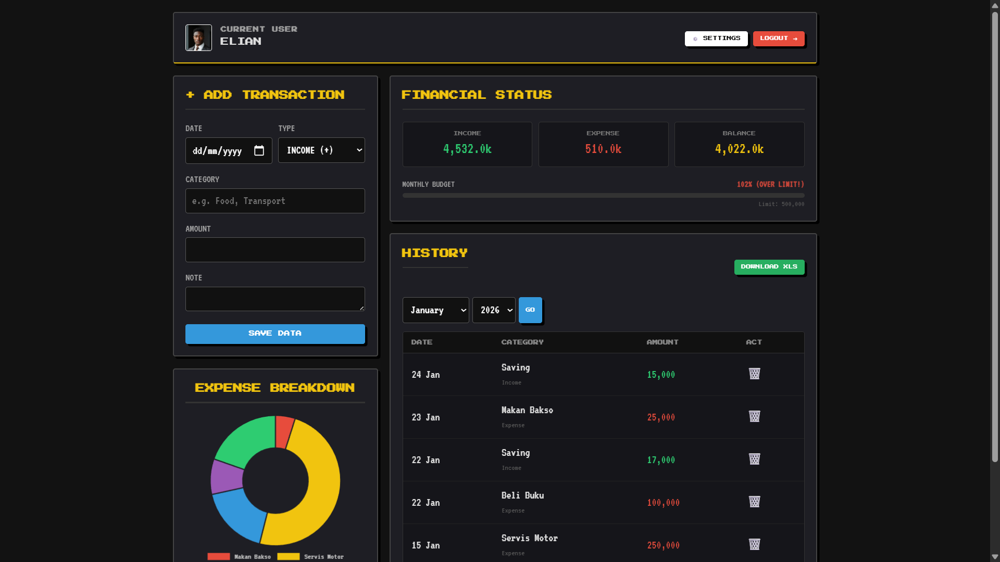
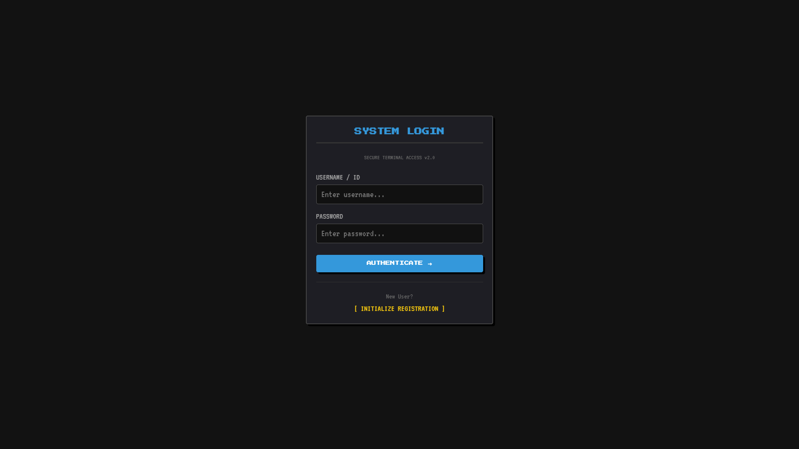
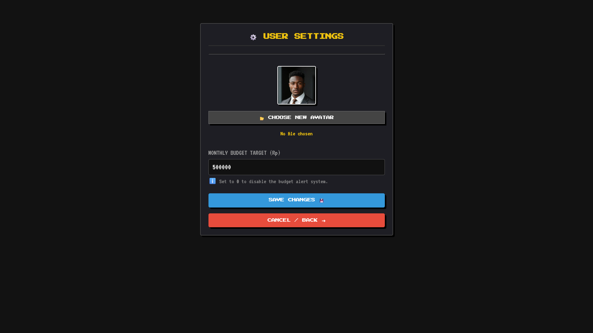
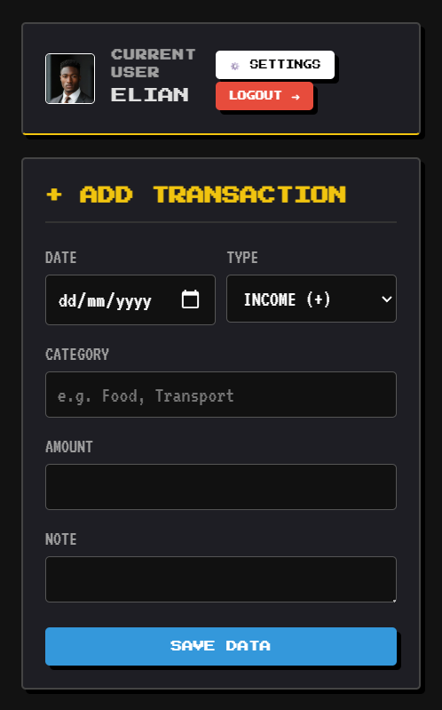

# ⚔️ Uangku - RPG Finance Tracker

> **"Manage your finances like a gamer."**
> Aplikasi pencatat keuangan berbasis web dengan tema **Dark Pixel RPG**. Mengubah aktivitas mencatat pengeluaran yang membosankan menjadi pengalaman visual yang menyenangkan.



## 🌟 Key Features (Fitur Unggulan)

### 🛡️ Core System
* **Secure Authentication:** Sistem Login & Register dengan enkripsi password (`password_hash`).
* **CRUD Transaksi:** Catat Pemasukan (Loot) dan Pengeluaran (Damage) dengan mudah.
* **Database Optimized:** Menggunakan MySQLi untuk penyimpanan data yang cepat dan aman.

### 🎨 UI/UX "Remastered"
* **Dark Pixel Theme:** Desain antarmuka retro modern yang nyaman di mata (Dark Mode).
* **Smooth Transitions:** Animasi perpindahan halaman *Fade In/Out* yang elegan.
* **Responsive Design:** Tampilan tetap rapi di Laptop maupun HP (Mobile Friendly).
* **Interactive Charts:** Visualisasi pengeluaran menggunakan **Chart.js** (Doughnut Chart).

### 🚀 Advanced Tools
* **Budget Health Bar:** Fitur target anggaran bulanan dengan visualisasi "HP Bar".
* **Time-Travel Protection:** Mencegah input tanggal masa depan.
* **Excel Export:** Download laporan keuangan bulanan ke format `.xls` sekali klik.
* **Search & Pagination:** Fitur pencarian cepat dan navigasi halaman data.
* **Custom Avatar:** Upload foto profil unik untuk setiap user.

## 🛠️ Tech Stack

* **Backend:** PHP (Native)
* **Database:** MySQL
* **Frontend:** HTML5, CSS3 (Custom Animations), JavaScript
* **Library:** Chart.js (Grafik), Google Fonts (Press Start 2P & VT323)

## 📸 Screenshots

| Login Terminal | Dashboard & Stats |
| :---: | :---: |
|  |  |

| User Settings | Mobile View |
| :---: | :---: |
|  |  |


## 📦 How to Install (Cara Install)

1.  **Clone Repository**
    ```bash
    git clone https://github.com/AerynnnSh/uangku-pixel
    ```
2.  **Setup Database**
    * Buka PHPMyAdmin / HeidiSQL.
    * Buat database baru bernama `uangku_db`.
    * Import file `database.sql` yang ada di folder proyek.
3.  **Konfigurasi**
    * Buka file `koneksi.php`.
    * Sesuaikan user/password database jika perlu.
4.  **Run!**
    * Buka browser dan akses `http://localhost/uangku`.
    * **Default Login:** Buat akun baru di menu Register.

## 📝 License

Project ini dibuat untuk tujuan belajar dan portofolio. Bebas dikembangkan ulang!
**Happy Grinding! 🎮**
